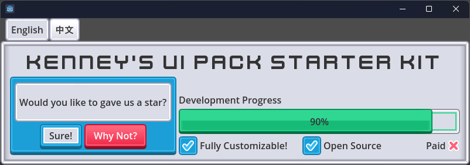

# Kenney UI-Pack Starter Kit for Godot 4

English | [中文](./README_zh-cn.md)

This is a user interface theme for Godot 4, built using the [Kenney UI Pack](https://www.kenney.nl/assets/ui-pack). It leverages the [ThemeGen](https://godotengine.org/asset-library/asset/3299) plugin for fully code-driven styling. Ideal for creating a consistent and visually appealing UI system in your project.

---

## 🔧 How to Integrate into Your Project

Getting started with this starter kit is simple:

1. Copy the `themes/` folder from this project into your own Godot 4 project.
2. Choose one of the following integration approaches based on your needs:

   ### ✅ **Using Prebuilt Theme Only**

   * Delete the `themes/main_theme.gd` file and keep only `main_theme.tres`.
   * *(Optional)* Set `res://themes/main_theme.tres` as the default theme in your project settings.

   ### 🛠️ **Customizing Theme with Code**

   1. Install the [ThemeGen](https://godotengine.org/asset-library/asset/3299) plugin from the Godot **AssetLib**.
   2. Enable the plugin via `Project > Project Settings > Plugins > theme_gen_save_sync`.
   3. Use the `main_theme.gd` script to generate and update theme styles dynamically.

---

## 🧩 Supported UI Controls

This theme supports nearly all major UI components in Godot.

### 🎨 Color-Variant Controls (5 Styles)

The following components come with five style variants:

* Default (Gray)
* Primary (Blue)
* Success (Green)
* Warning (Yellow)
* Danger (Red)

Supported nodes:

* `Panel` / `PanelContainer`
* `Button` / `CheckBox` / `CheckButton`
* `HSlider` / `VSlider`
* `TabContainer`
* `ProgressBar`
* `Tree`
* `ItemList`

### 🧱 Other Common Controls

* `LineEdit` / `TextEdit` / `CodeEdit`
* `Label`
* `MarginContainer`

---

## 🚧 Future Plans

We aim to expand support for additional styles and variants:

### 🎮 Kenney UI Extensions

* [UI Pack - Adventure](https://www.kenney.nl/assets/ui-pack-adventure)
* [UI Pack - SciFi](https://www.kenney.nl/assets/ui-pack-sci-fi)
* [UI Pack (RPG Expansion)](https://www.kenney.nl/assets/ui-pack-rpg-expansion)

### 🕹️ Pixel Art Variants

* [UI Pack - Pixel Adventure](https://www.kenney.nl/assets/ui-pack-pixel-adventure)
* [Pixel UI Pack](https://www.kenney.nl/assets/pixel-ui-pack)

---

## 🙏 Special Thanks

* **Kenney.nl** — Free, high-quality game asset library: [https://kenney.nl](https://kenney.nl)
* **Godot Engine** — Powerful, free, open-source game engine
* **ThemeGen** — Arguably the most efficient UI styling solution for Godot

---

## ✅ Projects Using This Theme

* [🔍 GreyHack Save Viewer](https://github.com/Kingsmai/greyhack-save-viewer)
* [💽 Godot Song Manager](https://github.com/Kingsmai/godot-song-manager)

---

## 🤝 Contributing

We welcome contributions from the community:

* Add support for missing controls? Feel free to open a PR.
* Got ideas for improvement? Open an issue.
* Your contributions matter — thank you!

> **If you’re using this theme in your own project, we’d love to see it! Feel free to share a link in [Issues](https://github.com/your-repo/issues), and we’ll be happy to feature it here.**

---

## 📄 License

This project is open-sourced under the **MIT License**. Third-party assets (such as Kenney UI resources) are licensed under their respective terms.
