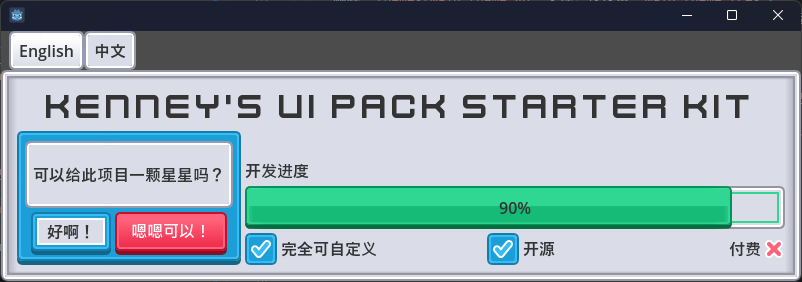

# Kenney UI-Pack Starter Kit for Godot 4

<<<<<<< HEAD
[English](./README.md) | 中文

=======
>>>>>>> 11fb0b939a705a806e11a68d4ce7c768c34d2bfc
这是一个基于 [Kenney's UI Pack](https://www.kenney.nl/assets/ui-pack) 构建的 Godot 4 用户界面主题 Starter Kit。项目采用 [ThemeGen](https://godotengine.org/asset-library/asset/3299) 插件，支持完全编程式样式生成，适用于构建统一、现代、美观的 UI 系统。

---

## 🔧 如何集成到你的项目中？

将本 Starter Kit 集成至你的 Godot 4 项目十分简单：

1. 将本项目中的 `themes/` 文件夹复制到你的项目目录中。
2. 依据需求，选择以下两种集成方式之一：

   ### ✅ **仅使用预设 UI 主题**

   * 删除 `themes/main_theme.gd` 文件，仅保留 `main_theme.tres`。
   * 在项目设置中设置 `res://themes/main_theme.tres` 为默认主题（可选）。

   ### 🛠️ **需要自定义样式的高级用法**

   1. 通过 Godot 的 **AssetLib** 安装 [ThemeGen](https://godotengine.org/asset-library/asset/3299) 插件。
   2. 启用插件：`Project > Project Settings > Plugins > theme_gen_save_sync`。
   3. 使用 `main_theme.gd` 脚本自动生成主题样式。

---

## 🧩 支持的 UI 控件

本主题支持 Godot 引擎中几乎所有主流 UI 控件。

### 🎨 具备颜色风格的控件（五种风格）

以下控件提供五种样式变体：

* Default（灰）
* Primary（蓝）
* Success（绿）
* Warning（黄）
* Danger（红）

支持组件：

* `Panel` / `PanelContainer`
* `Button` / `CheckBox` / `CheckButton`
* `HSlider` / `VSlider`
* `TabContainer`
* `ProgressBar`
* `Tree`
* `ItemList`

### 🧱 其他常用控件

* `LineEdit` / `TextEdit` / `CodeEdit`
* `Label`
* `MarginContainer`

---

## 🚧 未来计划

计划支持更多风格和扩展包：

### 🎮 Kenney 官方拓展包

* [UI Pack - Adventure](https://www.kenney.nl/assets/ui-pack-adventure)
* [UI Pack - SciFi](https://www.kenney.nl/assets/ui-pack-sci-fi)
* [UI Pack (RPG Expansion)](https://www.kenney.nl/assets/ui-pack-rpg-expansion)

### 🕹️ 像素风格支持

* [UI Pack - Pixel Adventure](https://www.kenney.nl/assets/ui-pack-pixel-adventure)
* [Pixel UI Pack](https://www.kenney.nl/assets/pixel-ui-pack)

---

## 🙏 特别鸣谢

* **Kenney.nl** — 免费高质量游戏资源： [https://kenney.nl](https://kenney.nl)
* **Godot Engine** — 强大、自由、开源的游戏开发工具
* **ThemeGen** — 目前最灵活高效的 UI 样式生成解决方案之一

---

## ✅ 已应用项目示例

* [🔍 GreyHack 存档查看器](https://github.com/Kingsmai/greyhack-save-viewer)

---

## 🤝 贡献方式

我们热忱欢迎社区的参与与支持：

* 若您补充了未覆盖的 UI 控件，欢迎提交 PR
* 若有改进建议，欢迎提出 ISSUE
* 您的任何贡献都对本项目意义重大！

> **欢迎在自己的项目中使用本主题，如愿意展示您的成果，欢迎在 [Issues](https://github.com/your-repo/issues) 留言项目链接，我们将乐于收录展示！**

---

## 📄 License

本项目以 **MIT License** 开源，所使用的第三方资源（如 Kenney UI 素材）遵循其各自的许可协议。
